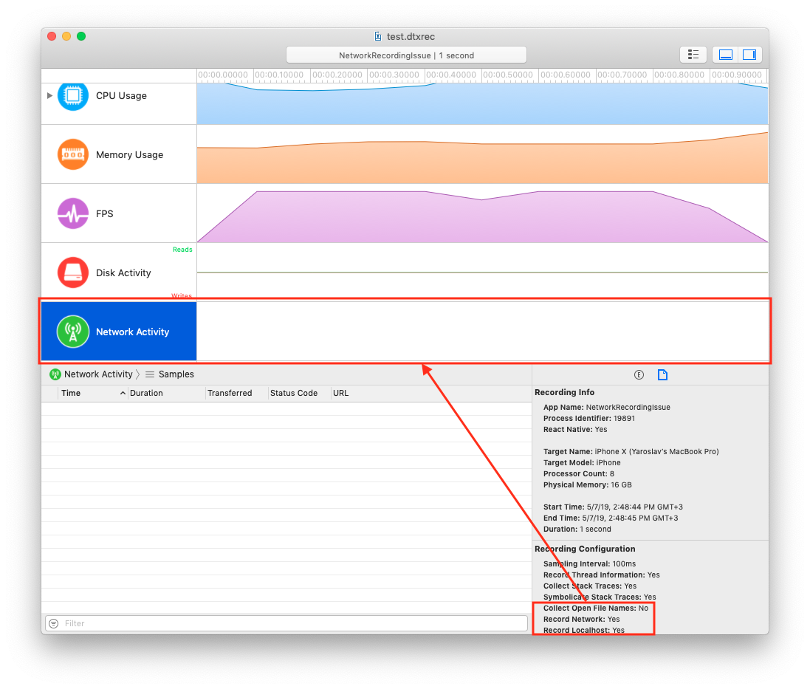

# Description

The recent pull request to Detox (["Record network and events in Detox Instruments artifacts"](https://github.com/wix/Detox/pull/1333))
should have enabled recording network requests in the integration of Detox and Detox Instruments
(introduced originally in [wix/Detox#1165](https://github.com/wix/Detox/pull/1165)).  However, it does not seem to work as intended.

This demo project demonstrates the bug.

# Environment

* MacOS Mojave (10.14.4)
* Xcode 10.2.1 (10E1001)
* Detox Instruments 1.10 (10233)
* Node.js 10.15.0 (installed via `nvm`)
* Detox 12.6.3
* iPhone X (in Simulator)

## Steps to reproduce

1. Clone this repository.
2. Checkout to branch `detox/no-network-recording`.
3. Run `npm install`.
4. Run `npm start`.
5. In other tty, run `npm test`.
6. Wait till the test completes.
7. Open with Detox Instruments `artifacts/ios.<YYYY-MM-DD HH-mm-ssZ>/✓ Example should have welcome screen/test.dtxrec`.

## Expected result

**Network Activity** timeline should have at least 1 request:

```
GET 200 http://worldclockapi.com/api/json/utc/now
```

## Actual result

**Network Activity** timeline is empty.


